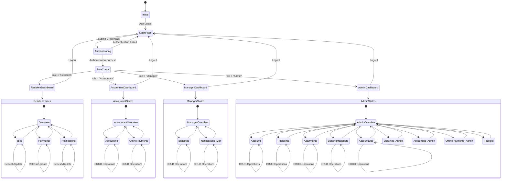
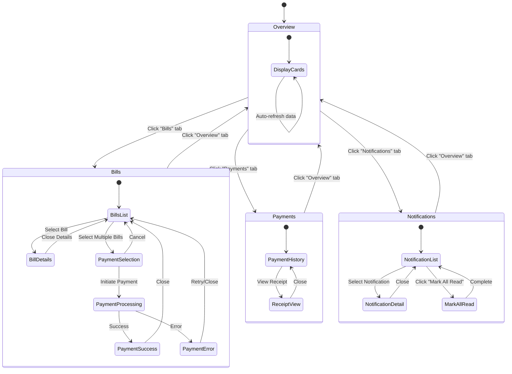
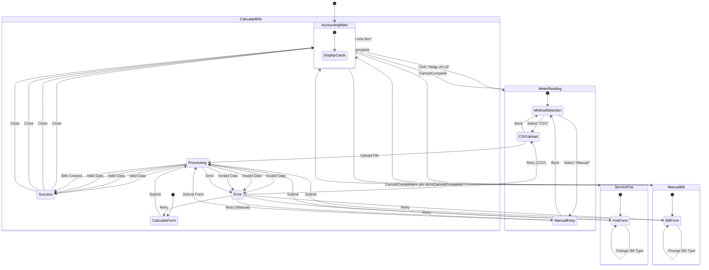
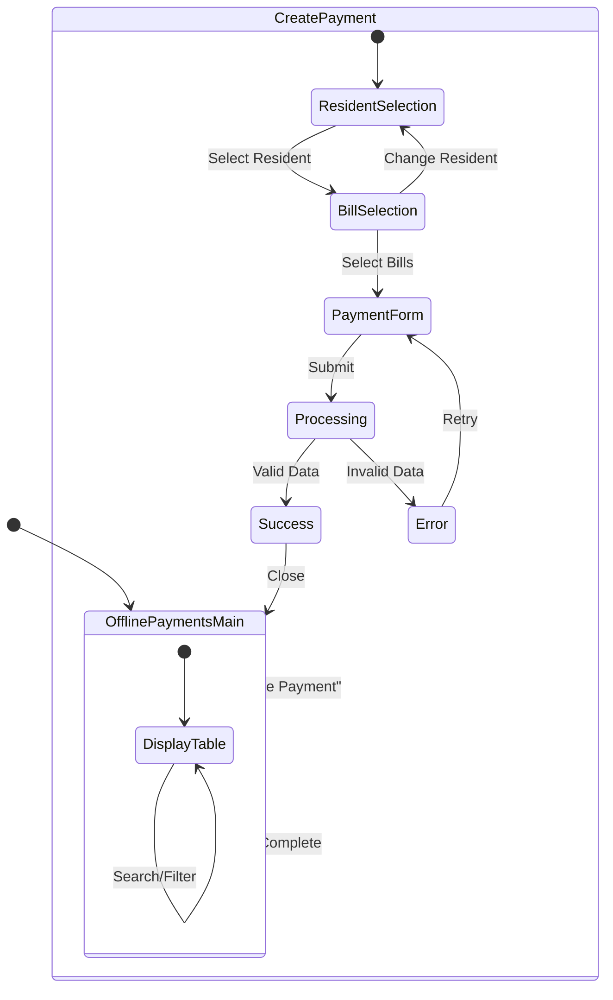
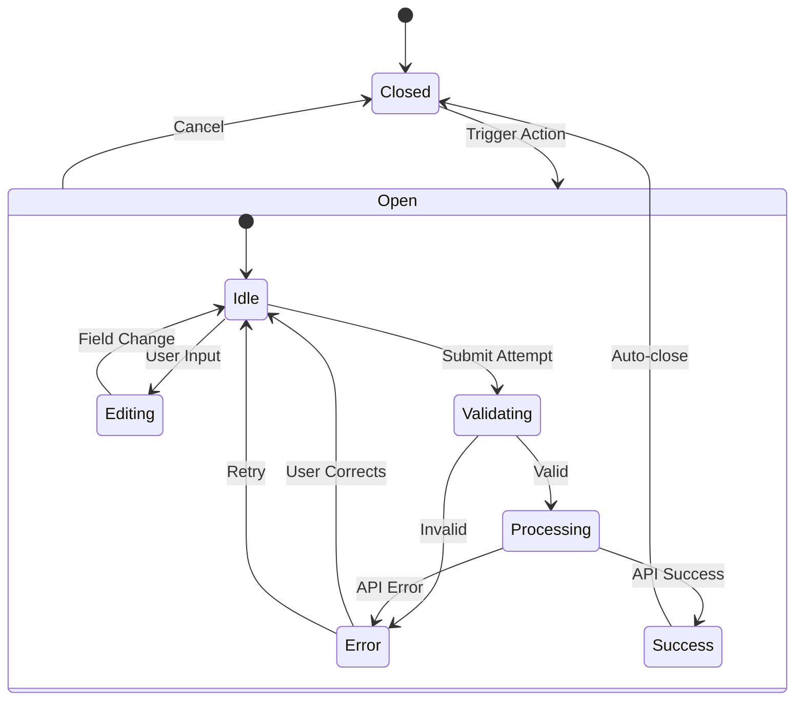
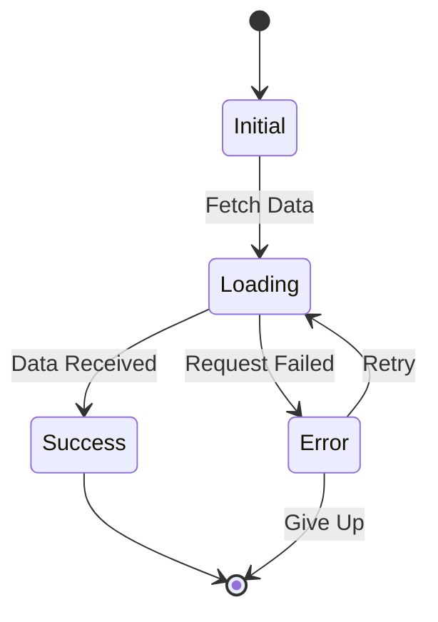
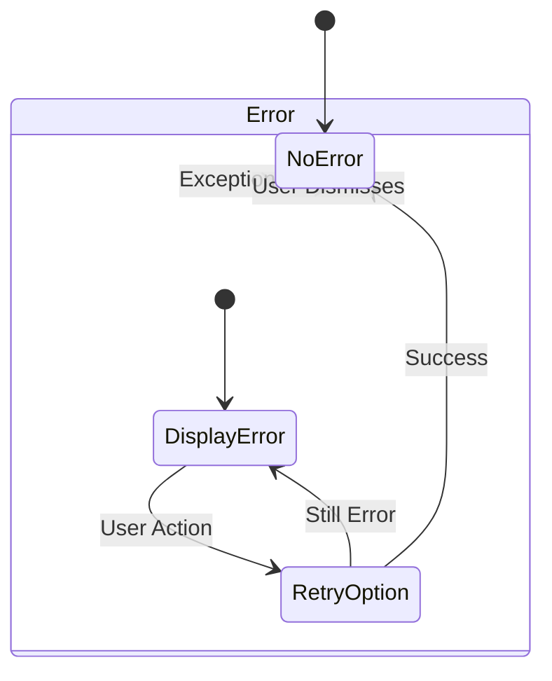

# BlueMoon Building Management System - State Transition Diagram

## Overview
This document describes the complete state transition diagram for the BlueMoon building management system frontend user interface.

---

## Main State Flow Diagram



---

## Detailed State Descriptions

### 1. Authentication States

#### Initial State
- **Entry Point**: Application loads
- **Actions**: Check for existing token in localStorage
- **Transitions**:
  - → `LoginPage` if no valid token
  - → `RoleCheck` if valid token exists

#### LoginPage
- **UI**: Login form with username/password fields
- **User Actions**:
  - Enter credentials
  - Click "Login" button
- **State Variables**:
  - `username: string`
  - `password: string`
  - `isLoading: boolean`
  - `error: string | null`
- **Transitions**:
  - → `Authenticating` on form submit
  - → `RoleCheck` on successful authentication

#### Authenticating
- **UI**: Loading spinner overlay
- **Backend Call**: `POST /api/auth/login`
- **Transitions**:
  - → `LoginPage` with error message on failure
  - → `RoleCheck` on success

#### RoleCheck
- **Logic**: Determine user role from authentication response
- **Transitions**:
  - → `ResidentDashboard` if role = "Resident"
  - → `AccountantDashboard` if role = "Accountant"
  - → `ManagerDashboard` if role = "Manager"
  - → `AdminDashboard` if role = "Admin"

---

### 2. Resident Dashboard States



#### Resident Overview Tab
- **State Variables**:
  - `stats: { totalBills, unpaidBills, totalAmount }`
  - `isLoading: boolean`
  - `error: string | null`
- **API Calls**: `GET /api/bills/my-bills`
- **Refresh Trigger**: Tab focus, manual refresh

#### Resident Bills Tab
- **State Variables**:
  - `bills: Bill[]`
  - `selectedBills: number[]`
  - `filterStatus: "All" | "Unpaid" | "Paid" | "Overdue"`
  - `isLoading: boolean`
- **User Actions**:
  - Select/deselect bills
  - Filter by status
  - View bill details
  - Initiate payment
- **Transitions**:
  - → `PaymentSelection` when bills selected
  - → `BillDetails` modal when viewing details

#### Resident Payments Tab
- **State Variables**:
  - `transactions: PaymentTransaction[]`
  - `isLoading: boolean`
- **User Actions**:
  - View payment history
  - Click receipt to view details
- **API Calls**: `GET /api/payments/my-history`

#### Resident Notifications Tab
- **State Variables**:
  - `notifications: Notification[]`
  - `unreadCount: number`
  - `isLoading: boolean`
  - `selectedNotification: Notification | null`
- **User Actions**:
  - View notification list
  - Mark as read (individual)
  - Mark all as read
  - View meter reading details
- **API Calls**: 
  - `GET /api/notification/my-notification`
  - `PUT /api/notification/{id}/read`
  - `PUT /api/notification/mark-all-read`

---

### 3. Admin Dashboard States

```mermaid
stateDiagram-v2
    [*] --> AdminOverview
    
    state AdminOverview {
        [*] --> DisplayStats
    }
    
    state Accounts {
        [*] --> AccountsList
        AccountsList --> CreateAccountModal: Click "Create"
        CreateAccountModal --> AccountsList: Cancel/Success
        AccountsList --> EditAccountModal: Click "Edit"
        EditAccountModal --> AccountsList: Cancel/Success
        AccountsList --> DeleteConfirmation: Click "Delete"
        DeleteConfirmation --> AccountsList: Cancel/Success
    }
    
    state Residents {
        [*] --> ResidentsList
        ResidentsList --> CreateResidentModal: Click "Create"
        CreateResidentModal --> ResidentsList: Cancel/Success
        ResidentsList --> EditResidentModal: Click "Edit"
        EditResidentModal --> ResidentsList: Cancel/Success
        ResidentsList --> DeleteConfirmation: Click "Delete"
        DeleteConfirmation --> ResidentsList: Cancel/Success
    }
    
    state Apartments {
        [*] --> ApartmentsList
        ApartmentsList --> CreateApartmentModal: Click "Create"
        CreateApartmentModal --> ApartmentsList: Cancel/Success
        ApartmentsList --> EditApartmentModal: Click "Edit"
        EditApartmentModal --> ApartmentsList: Cancel/Success
        ApartmentsList --> DeleteConfirmation: Click "Delete"
        DeleteConfirmation --> ApartmentsList: Cancel/Success
    }
    
    state Accountants {
        [*] --> AccountantsList
        AccountantsList --> CreateAccountantModal: Click "Create"
        CreateAccountantModal --> AccountantsList: Cancel/Success
        AccountantsList --> EditAccountantModal: Click "Edit"
        EditAccountantModal --> AccountantsList: Cancel/Success
        AccountantsList --> DeleteConfirmation: Click "Delete"
        DeleteConfirmation --> AccountantsList: Cancel/Success
    }
    
    state BuildingManagers {
        [*] --> ManagersList
        ManagersList --> CreateManagerModal: Click "Create"
        CreateManagerModal --> ManagersList: Cancel/Success
        ManagersList --> EditManagerModal: Click "Edit"
        EditManagerModal --> ManagersList: Cancel/Success
        ManagersList --> DeleteConfirmation: Click "Delete"
        DeleteConfirmation --> ManagersList: Cancel/Success
    }
```



---

### 4. Accounting Tab States (Accountant/Admin)



#### Meter Reading States
- **MethodSelection**
  - User chooses between CSV upload or manual entry
  - State: `meterReadingMethod: "csv" | "manual" | null`

- **CSVUpload**
  - State: `csvFile: File | null`
  - Validation: File type must be CSV
  - Processing: Parse CSV and batch upload

- **ManualEntry**
  - State: `meterReading: MeterReadingCreate`
  - Fields: apartmentID, month, year, old/new electricity, old/new water
  - Validation: All fields required

#### Service Fee States
- **FeeForm**
  - State: `serviceFee: ServiceFeeCreate`
  - Dynamic fields based on `typeOfBill`:
    - Electricity/Water → Show `feePerUnit`
    - Management/Parking/Internet → Show `flatFee`
    - Other → Show both fields + custom name input
  - State: `otherBillType: string` (when typeOfBill = "Other")

#### Manual Bill States
- **BillForm**
  - State: `manualBill: BillCreate`
  - Dynamic fields based on `typeOfBill`:
    - Electricity/Water → Show `total` field
    - Management/Parking/Internet → Show `amount` field
    - Other → Show both fields + custom name input
  - Loads: `apartments[]`, `accountants[]`

#### Calculate Bills States
- **CalculateForm**
  - State: `calculateRequest: CalculateBillsRequest`
  - Fields: month, year, deadline_day, overwrite checkbox
  - API: `POST /api/accounting/bills/calculate`

---

### 5. Offline Payments Tab States (Accountant/Admin)



#### Offline Payment Creation States
- **ResidentSelection**
  - State: `selectedResident: Resident | null`
  - Dropdown populated from `residents[]`

- **BillSelection**
  - State: `selectedBills: number[]`
  - Filters bills by selected resident
  - Shows only unpaid bills

- **PaymentForm**
  - State: `payment: OfflinePaymentRequest`
  - Fields: paymentMethod, paymentContent
  - Calculates total amount from selected bills

---

### 6. Modal/Dialog States



#### Common Modal States
- **Idle**: Form ready for input
- **Editing**: User actively filling form
- **Validating**: Client-side validation in progress
- **Processing**: API call in progress (loading spinner)
- **Error**: Show error message, allow retry
- **Success**: Show success toast, close modal

---

### 7. Loading States



#### Loading State Variables
- **Global**: `isLoading: boolean`
- **Per Operation**: 
  - `isLoadingBills: boolean`
  - `isLoadingNotifications: boolean`
  - `isProcessing: boolean` (for mutations)

---

### 8. Error States



#### Error Handling
- **Toast Notifications**: Brief error messages
- **Inline Errors**: Form validation errors
- **Full-Page Errors**: Critical failures (403, 500)
- **Retry Logic**: Automatic for network errors

---

## State Persistence

### LocalStorage
- `access_token: string` - JWT token
- `username: string` - Current user
- `role: string` - User role

### Session State (React State)
- Current tab/view
- Form data (temporary)
- Selected items
- Filter/search criteria

### Server State (API)
- User data
- Bills, payments, notifications
- All CRUD entity data

---

## State Transition Rules

### Authorization Rules
1. **Resident** → Can only access Resident Dashboard states
2. **Accountant** → Can access Accounting + Offline Payments states
3. **Manager** → Can access Manager Dashboard states
4. **Admin** → Can access ALL states

### Navigation Rules
1. Tab changes preserve role context
2. Logout from any state → LoginPage
3. Token expiry from any state → LoginPage
4. Modal states are overlay states (parent state preserved)

### Data Refresh Rules
1. Tab switch → Refresh data
2. CRUD success → Refresh list
3. Auto-refresh → Every 30 seconds (notifications)
4. Manual refresh → Button click

---

## State Machine Properties

### Deterministic
- Each state has defined transitions
- No ambiguous state changes

### Complete
- All possible states are defined
- All transitions are handled

### Atomic
- State changes are instantaneous
- No partial states

### Recoverable
- All error states have recovery paths
- User can always navigate back to stable state

---

## Implementation Notes

### React State Management
```typescript
// Global Auth State
const [user, setUser] = useState<User | null>(null);
const [isAuthenticated, setIsAuthenticated] = useState(false);

// Tab State
const [activeTab, setActiveTab] = useState<string>("overview");

// Modal State
const [showModal, setShowModal] = useState(false);
const [modalData, setModalData] = useState<any>(null);

// Loading State
const [isLoading, setIsLoading] = useState(false);

// Error State
const [error, setError] = useState<string | null>(null);
```

### State Transition Handlers
```typescript
// Authentication transition
const handleLogin = async (username: string, password: string) => {
  setState("Authenticating");
  try {
    const response = await api.auth.login(username, password);
    setState("RoleCheck");
    navigateToRoleDashboard(response.role);
  } catch (error) {
    setState("LoginPage");
    showError(error.message);
  }
};

// CRUD transition
const handleCreate = async (data: any) => {
  setState("Processing");
  try {
    await api.entity.create(data);
    setState("Success");
    refreshList();
    closeModal();
  } catch (error) {
    setState("Error");
    showError(error.message);
  }
};
```

---

## Diagrams Summary

1. **Main State Flow**: Authentication → Role-based Dashboard
2. **Resident States**: Overview, Bills, Payments, Notifications
3. **Admin States**: 9 management tabs with CRUD operations
4. **Accounting States**: 4 card-based operations with modals
5. **Modal States**: Idle → Processing → Success/Error
6. **Loading States**: Initial → Loading → Success/Error
7. **Error States**: Display → Retry → Success/Dismiss

---

## Total State Count

- **Authentication**: 4 states
- **Resident Dashboard**: 12+ states
- **Accountant Dashboard**: 8+ states
- **Manager Dashboard**: 6+ states
- **Admin Dashboard**: 40+ states
- **Modals**: 6 states per modal × ~15 modals = 90+ states
- **Total**: ~160+ distinct UI states

---

## Conclusion

The BlueMoon frontend implements a comprehensive state machine with:
- ✅ Clear separation of concerns by role
- ✅ Predictable state transitions
- ✅ Robust error handling and recovery
- ✅ Proper loading states for all async operations
- ✅ Modal overlay states that preserve parent context
- ✅ Data refresh mechanisms
- ✅ Authorization enforcement at state level
